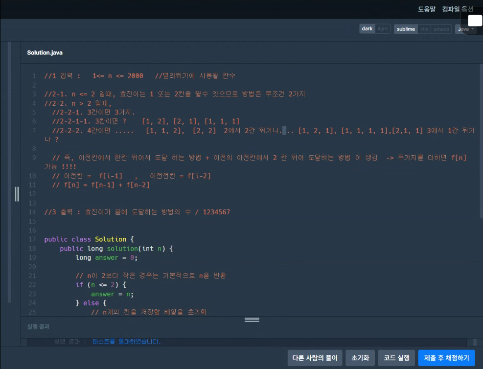

<b>99클럽 코테 스터디 22일차 TIL + 동적계획법</b>

- 오늘의 학습 키워드 : 동적계획법
- 공부한 내용 본인의 언어로 정리하기
    ```java
        package club.middler;

        // https://school.programmers.co.kr/learn/courses/30/lessons/12914
        class Day22_멀리_뛰기 {
          public static long[] dp = new long[2001];
          public long solution(int n) {
            long answer = 0;
            answer = fibonacci(n);
            return answer;
          }
          public static long fibonacci(int n) {
            if (n == 1) {
              return 1;
            } else if (n == 2) {
              return 2;
            } else if (dp[n] != 0) {
              return dp[n];
            } else {
              dp[n] = (fibonacci(n - 1) + fibonacci(n - 2)) % 1234567; // 오버플로우 방지
              return dp[n];
            }
          }
          /*
          * n : 1 -> 1
          * n : 2 -> 2
          * n : 3 -> 3
          * n : 4 -> 5
          * n : 5 -> 8
          * n : 6 -> 13
          * n : 7 -> 21
          */
        }
    ```
- 오늘의 회고
  - 6주 중 3주, 반이 됐다
  - 열심히, 잘 했는지 생각해봤는데 아닌 것 같다 (반성..)
    - 문제 풀 때 생각하면서 풀기
    - ```
        1. 입력 : 어떤식으로 변수가 입력되는지
        
        2. 필요 기능 - 문제를 쪼개기, 역순으로 타고 올라가기
          2-1. 세부 기능 1
            2-1-1. 세부 기능 1-1
              2-1-1-1. 세부 기능 1-1-1
          2-2. 세부 기능 2
            2-2-1. 세부 기능 2-1
            2-2-2. 세부 기능 2-2

        3. 출력 : 어떤 식으로 출력을 해야 되는지
      ```
    - 
  - 남은 3주(반)은 진짜진심으로 팟팅
- 오늘의 회고 2
  - 멀리뛰기에 사용될 칸의 수가 n일 때<br>효진이가 끝에 도달하는 방법은 아래와 같다
    - ```
        n : 1 -> 1
        n : 2 -> 2
        n : 3 -> 3
        n : 4 -> 5
        n : 5 -> 8
        n : 6 -> 13
        n : 7 -> 21
      ```
  - 위의 내용을 참고했을 때 피보나치 수열과 같은 형태라는 것을 알 수 있다
    - ```
        피보나치 수
        F(0) = 0, F(1) = 1일 때, 1 이상의 n에 대하여 F(n) = F(n-1) + F(n-2) 가 적용되는 수
      ```
  - `=> 문제를 풀 때 규칙을 찾아야 함`
  - n은 2 이상 100,000 이하인 자연수이기 때문에 n이 클수록 오버플로우가 생길 수 있다
    - ```
        오버플로우
        타입이 허용하는 최댓값을 벗어나는 것
        (에러는 아니다)
        오버플로우가 발생하면 해당 타입의 최솟값으로 되돌아간다
      ```
    - 
  - 오버플로우를 방지하기 위해서 `모듈러 연산`을 사용한다
    - <h6><i>출처 : <a href="https://ajar-utensil-d36.notion.site/99-20-TIL-989317edccfa4fefb1a0956cfcaf788f">진호님 TIL</a></i></h6>
    - ```
        모듈러 연산 : 두 수를 나누고 나머지를 구하는 연산이다.

        모듈러 연산은 주기를 갖는다. (결과는 항상 0부터 (m-1)까지의 값을 가진다.)

        예시)
        ( 0 \mod 5 = 0 )
        ( 1 \mod 5 = 1 )
        ( 2 \mod 5 = 2 )
        ( 3 \mod 5 = 3 )
        ( 4 \mod 5 = 4 )
        ( 5 \mod 5 = 0 ) (여기서 주기가 시작됨)
        ( 6 \mod 5 = 1 )

        결과가 너무 커져서 오버플로우가 되는 것을 방지한다. (피보나치 수열을 계산할 때 각 단계에서 모듈러 연산을 수행하면 결과가 항상 일정 범위 내에 머물게 된다.)

        알고리즘에서 자주 사용된다. (소수와 관련된 문제나, 대수적 구조에서 중요한 역할을 한다.)

        반복문을 통해 2부터 n까지의 피보나치 수를 계산한다. 각 계산에 대해 1234567로 나눈 나머지를 저장하여 오버플로우를 방지한다.
      ```

#99클럽 #코딩테스트준비 #개발자취업 #항해99 #TIL
